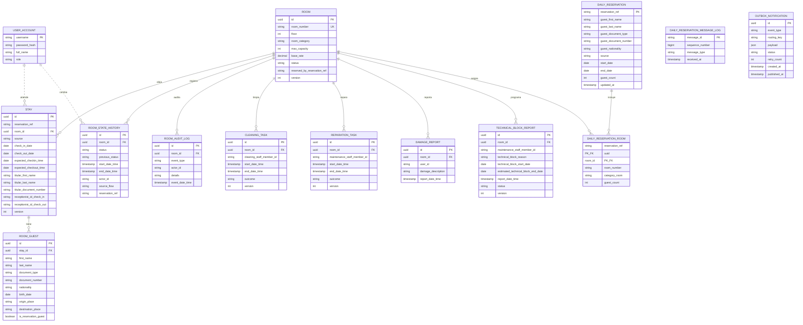

# Implementation Plan: Base del Módulo 1 (Plataforma Compartida - Habitaciones, Inventario, Check-In y Check-Out)

**Date**: 2026-10-06  
**Spec**: [diccionario.md](../../contexto/diccionario.md), [hospitua.md](../../contexto/hospitua.md), [maquina-estados-habitacion.md](../../SPEC/referencias/maquina-estados-habitacion.md) y los `spec-*.md` de Módulo 1 en `documentos/SPEC/`. Este plan no implementa una feature específica: deja lista la plataforma técnica base que todos los planes de feature de Módulo 1 reutilizan.

---

## Summary

El **Módulo 1 (Gestión de Habitaciones e Inventario de Aforo, Check-In y Check-Out)** digitaliza la infraestructura física del hotel, controla la disponibilidad en tiempo real y gestiona directamente la admisión (`Check-In`) y salida (`Check-Out`) física de los huéspedes. Es la fuente de verdad del inventario habitacional (`Room`), de los 8 estados canónicos de su ciclo de vida y de las ocupaciones físicas reales (`Stay` y ocupantes inmutables `RoomGuest`).

Opera el **Panel de Recepción** al inicio de la jornada, consultando la copia local de la lista diaria de reservas (alimentada por la cola `m1.reservas.diarias.queue`) para las llegadas del día y las estancias activas locales para las salidas, operando de forma 100% autónoma sin peticiones REST a Módulo 2 para llegadas ni para Check-In. Durante el Check-In formaliza la ocupación transicionando atómicamente la habitación de `Reserved` a `Occupied`, captura y valida los datos de identidad de los huéspedes (`RoomGuest`: titular y acompañantes con nombres y apellidos separados, campos migratorios si extranjero) y notifica de forma asíncrona por la cola `m2.habitacion.checkin.queue` en un mensaje plano con `guests[]` conteniendo a todos los ocupantes (sin cola separada de extranjeros). Durante el Check-Out consulta síncronamente a Módulo 3 la liquidación (`SettlementSummary`: informativa o final), formaliza la salida transicionando la habitación a `PendingCleaning` (pasando de inmediato a la bandeja del Personal de limpieza) y notifica de forma asíncrona por la cola `m2.habitacion.checkout.queue` con `guests[]` conteniendo a todos los ocupantes para que Módulo 2 registre la salida de la habitación. Además, atiende solicitudes síncronas de Módulo 2 (consultar inventario por categoría o estado y consultar información de mantenimientos) y de Módulo 3 (consultar tarifa base).

Gestiona además el inventario (registro, edición, baja y reactivación de habitaciones por el Administrador; consulta del inventario y del historial de estados por el Gerente) y el ciclo operativo de limpieza y mantenimiento: el Personal de limpieza toma habitaciones desde su panel y confirma o libera su tarea activa; el Personal de mantenimiento reporta daños, programa bloqueos técnicos que un trabajo autónomo aplica en su fecha de inicio (o que se aplican de inmediato si inician el mismo día) e interviene las habitaciones mediante tareas de reparación. Toda transición de estado queda registrada por periodos en el historial de estados (`room_state_history`).

Este plan unifica el stack tecnológico, arquitectura hexagonal, modelo de persistencia relacional, contratos de integración (REST y colas RabbitMQ), política de resiliencia "HTTP a Cola", manejo de errores uniforme (siempre 4xx, nunca 500 no controlado) y la infraestructura transversal de pruebas.

---

## Technical Context

- **Language/Version**: Java 21 (LTS)
- **Primary Dependencies**: Spring Boot 3.3+, Spring Web, Spring Data JPA, Bean Validation (Hibernate Validator), Lombok, Spring AMQP (RabbitMQ), Spring Security, Flyway
- **Storage**: PostgreSQL 16+
- **Build Tool**: Maven 3.9+
- **Messaging**: RabbitMQ 3.13+ (Exchange topic `hospitua.events`, colas durables, Dead-Letter Exchange)
- **Testing**: JUnit 5, Mockito, Spring Boot Test, Testcontainers (PostgreSQL, RabbitMQ), MockRestServiceServer
- **Target Platform**: Servidor Linux/Windows + Navegador Web moderno
- **Project Type**: Web Application monorepo estructurado (`backend/` + `frontend/`)
- **API**: REST JSON, con errores en el formato `ApiError` (sección "Formato Estándar de Error")
- **Frontend**: React 18+ con JavaScript puro (JSX) y Vite (componentes basados en las vistas prototipo en `documentos/vistas/recepcionista/`)
- **Version Control**: Git + GitHub (estrategia Gitflow)
- **Performance Goals**:
  - Transición física atómica de habitación (`Room.status`) < 50 ms p95.
  - Despacho de notificaciones asíncronas vía Outbox < 100 ms.
  - Carga del Panel de Recepción < 500 ms (consulta 100% local).
  - Consulta reactiva de liquidación a Módulo 3 en Check-Out < 800 ms.
  - Flujo de Check-In en mostrador: < 2 min (nacionales), < 3 min (extranjeros).
  - Flujo de Check-Out en mostrador: < 1 min desde recepción de liquidación.
- **Constraints**:
  - Ningún fallo externo (caída de Módulo 2 o Módulo 3) debe bloquear la entrega física o liberación de una habitación en el mostrador.
  - Cero operaciones financieras, cálculos de penalizaciones, IVA o cobros en pasarela dentro de Módulo 1 (responsabilidad exclusiva de Módulo 3).
  - Cero mutabilidad en la lista de `RoomGuest` tras completarse el Check-In.
  - Máquina de estados habitacional estricta: solo se admiten las transiciones canónicas descritas en `maquina-estados-habitacion.md`. Módulo 1 es el dueño exclusivo del ciclo de vida habitacional (decisiones B7 y B8: sin órdenes de bloqueo ni secuencias externas).
- **Scale/Scope**: Operación continua 24/7 en recepción, soporte para decenas/cientos de habitaciones, múltiples recepcionistas concurrentes, personal de limpieza y mantenimiento.

### Dependencias y herramientas transversales aprobadas

| Necesidad | Propuesta | Justificación |
| --- | --- | --- |
| Herramienta de compilación | Maven | Estándar empresarial con Spring Boot y soporte multi-módulo |
| Migraciones de Base de Datos | Flyway | Versionamiento determinista del esquema SQL en `src/main/resources/db/migration/` |
| Autenticación y Autorización | Spring Security + JWT | Control de acceso basado en roles (`RECEPTIONIST`, `ADMINISTRATOR`, `MANAGER`, `CLEANING_STAFF`, `MAINTENANCE_STAFF` y los roles de servicio `MODULE_2` y `MODULE_3` para Módulo 2 y Módulo 3) e intercomunicación segura entre servicios |
| Resiliencia y Timeouts REST | `RestClient` con timeouts + Resilience4j | Evitar bloqueos ante lentitud o caída de Módulo 2 o Módulo 3 |
| Patrón Outbox Transaccional | Tabla `outbox_notification` + `@Scheduled` worker | Garantiza entrega eventual y consistencia atómica entre la base de datos y RabbitMQ |
| Paquete base backend | `com.hospitua.habitaciones` | Convención estándar del dominio |

---

## Comunicación entre módulos

Regla arquitectónica de HOSPITUA:

- **Proactiva** (el módulo avisa la ocurrencia de un evento de negocio y no requiere esperar respuesta sincrónica) → **Cola RabbitMQ**.
- **Reactiva** (solicitud bajo demanda que requiere un dato o confirmación síncrona inmediata) → **REST**.

### Matriz de Integración de Módulo 1

| Interacción | Dirección | Mecanismo | Tipo | Feature / Caso de Uso |
| --- | --- | --- | --- | --- |
| **Notificación de Check-In** | M1 → M2 | Cola RabbitMQ (`m2.habitacion.checkin.queue` / routing key `habitacion.checkin`) con `guests[]` completo plano | Proactiva | `plan-registrar-check-in.md` |
| **Notificación de Check-Out** | M1 → M2 | Cola RabbitMQ (`m2.habitacion.checkout.queue` / routing key `habitacion.checkout`) con `guests[]` completo plano | Proactiva | `plan-registrar-check-out.md` |
| **Ingestión de Reservas Diarias** | M2 → M1 | Cola RabbitMQ (`m1.reservas.diarias.queue` / routing keys `reserva.lista-del-dia` y `reserva.lista-del-dia.actualizacion`) | Reactiva (push) | `plan-consultar-reservas.md` |
| **Consultar Inventario de Habitaciones** | M2 → M1 | REST GET (`/api/rooms?categoryRoom={cat}` y `/api/rooms/{roomId}`) — solo habitaciones vendibles (sin `Inactive`) | Reactiva | `spec-consultar-inventario-habitaciones.md` |
| **Consultar Disponibilidad de Reservas para Mantenimiento/Baja** | M1 → M2 | REST GET (`/api/reservations?dateFrom={d1}&dateTo={d2}&roomId={id}`) — solo para Mantenimiento/Administración | Reactiva | `plan-consultar-reservas.md` |
| **Consultar Liquidación** | M1 → M3 | REST GET (`/api/settlements?reservationRef={ref}&checkInDate={in}&checkOutDate={out}&source={src}&roomId={room}&categoryRoom={cat}`) | Reactiva | `plan-consultar-liquidacion.md`, `plan-registrar-check-out.md` |
| **Consultar Tarifa Base** | M3 → M1 | REST GET (`/api/rooms/{roomId}/base-rate`) | Reactiva | `plan-consultar-tarifa-base.md`, `spec-consultar-tarifa-base.md` |
| **Consultar Información de Mantenimientos** | M2 → M1 | REST GET (`/api/rooms/{roomId}/maintenance-availability?startDate={d1}&endDate={d2}`) — M2 la consulta antes de asignar una habitación a una reserva | Reactiva | `spec-consultar-informacion-mantenimientos.md` |

### Convenciones de Mensajería (RabbitMQ)

- **Exchange**: `hospitua.events` (Tipo: `topic`, durable).
- **Colas / Routing Keys emitidas por Módulo 1 hacia Módulo 2**:
  - `m2.habitacion.checkin.queue` (routing key `habitacion.checkin`): Disparada al confirmar el paso 4 de Check-In. Emite mensaje plano con `messageId`, `sequenceNumber`, `reservationRef`, `roomId`, `movementType = ENTRY`, `movementDate = checkInDate`, y el array `guests[]` con todos los ocupantes (nacionales y extranjeros; `birthDate` para todos y `originPlace`, `destinationPlace` incluidos únicamente si la nacionalidad es distinta de Colombia; `documentType` es `RC`, `TI`, `CC`, `CE`, `PAS` o `NIT`). Sin cola separada de extranjeros.
  - `m2.habitacion.checkout.queue` (routing key `habitacion.checkout`): Disparada al confirmar el paso 5 de Check-Out. Emite mensaje plano con `messageId`, `sequenceNumber`, `reservationRef`, `roomId`, `movementType = DEPARTURE`, `movementDate = checkOutDate`, y el array `guests[]` con todos los ocupantes (reutilizando los datos migratorios capturados en Check-In).
- **Cola recibida por Módulo 1 desde Módulo 2**:
  - `m1.reservas.diarias.queue`: Ingesta asíncrona para alimentar y actualizar la copia local de reservas del día:
    - Routing key `reserva.lista-del-dia`: Lista diaria de reservas `ACTIVE` con `startDate = hoy` recibida a las 00:00 (purga del día anterior, `sequenceNumber = 1`, transiciones automáticas `Available → Reserved`).
    - Routing key `reserva.lista-del-dia.actualizacion`: Actualizaciones continuas durante el día con acciones `ADDED`, `UPDATED` (evalúa `updatedAt`) o `REMOVED` (libera `Reserved → Available`).
- **Control de Idempotencia y Secuencia**:
  - Todo mensaje incluye `messageId` único para descarte de duplicados contra `daily_reservation_message_log`.
  - Mensajes recibidos: orden estricto por `sequenceNumber` dentro del mismo `operationalDate`.
  - Mensajes enviados: `sequenceNumber` creciente por cola, que nunca se reinicia (contrato de Módulo 2).
- **Estructura estándar de los mensajes salientes (formato plano unificado)**:

  ```json
  {
    "messageId": "UUIDv4",
    "sequenceNumber": 1,
    "reservationRef": "RES-000123",
    "roomId": "room-uuid",
    "movementType": "ENTRY | DEPARTURE",
    "movementDate": "YYYY-MM-DD",
    "guests": [
      {
        "firstName": "string",
        "lastName": "string",
        "documentType": "string",
        "documentNumber": "string",
        "nationality": "string",
        "birthDate": "YYYY-MM-DD",
        "originPlace": "Ciudad, País",
        "destinationPlace": "Ciudad, País"
      }
    ]
  }
  ```

### Traducción de Respuestas HTTP a Cola ("HTTP a Cola") y Resiliencia

De acuerdo con el diagrama arquitectónico oficial `mod-1-2-3.drawio`:

1. **Desacoplamiento asíncrono**: Check-In y Check-Out son eventos físicos que se consolidan **localmente y de forma inmediata** en la base de datos de Módulo 1 (`Stay`, `Room.status = Occupied` / `PendingCleaning`, `RoomGuest`).
2. **Patrón Transaccional Outbox**: La notificación a Módulo 2 se inserta en la tabla `outbox_notification` dentro de la **misma transacción ACID** que el cambio físico de la habitación.
3. **Despacho no bloqueante**: Un publicador asíncrono toma los registros pendientes y los deposita en RabbitMQ con acuse de recibo del broker (Publisher Confirms).
4. **Resiliencia ante caídas externas**: Si Módulo 2 está caído, con alta latencia o con fallos de base de datos, **el huésped no se retiene en el mostrador**. La habitación física queda entregada o enviada a limpieza, y la notificación se reintenta automáticamente en segundo plano con backoff exponencial.

---

## Contratos REST

### 1. Endpoints que Módulo 1 EXPONE (servicios propios)

| Método y Ruta | Consumidor | Propósito |
| --- | --- | --- |
| `GET /api/reception/arrivals?query={q}` | Recepcionista (Frontend M1) | Pestaña Llegadas del Panel de Recepción: habitaciones de las reservas del día desde la copia local, con búsqueda por código, documento o nombre (`plan-consultar-panel-recepcion.md`) |
| `GET /api/reception/departures?query={q}` | Recepcionista (Frontend M1) | Pestaña Salidas del Panel de Recepción: estancias activas locales (`plan-consultar-panel-recepcion.md`) |
| `GET /api/reception/panel/kpis` | Recepcionista (Frontend M1) | Indicadores del Panel de Recepción (`plan-consultar-panel-recepcion.md`) |
| `GET /api/check-in/validate?reservationRef={ref}&roomId={roomId}` | Recepcionista (Frontend M1) | Paso 1 del Check-In: validación de la reserva contra la copia local y de la habitación en `Reserved` (`plan-registrar-check-in.md`) |
| `POST /api/check-in` | Recepcionista (Frontend M1) | Formalización del Check-In (4 pasos: validación, captura `RoomGuest`, transición atómica a `Occupied`, outbox) |
| `POST /api/check-out` | Recepcionista (Frontend M1) | Formalización del Check-Out (5 pasos: consulta estancia, liquidación M3, resumen pago, transición a `PendingCleaning`, outbox) |
| `GET /api/check-out/active-stay?reservationRef={ref}&roomId={roomId}` | Recepcionista (Frontend M1) | Paso 1 del Check-Out: datos locales de la estancia activa de esa habitación (`plan-registrar-check-out.md`) |
| `GET /api/settlements/query` | Recepcionista (Frontend M1) | Pasos 2 y 3 del Check-Out: liquidación obtenida de Módulo 3 (`plan-consultar-liquidacion.md`) |
| `GET /api/rooms/{roomId}/decommission-conflicts` | Administrador (Frontend M1) | Verificación de reservas vigentes antes de dar de baja una habitación (`plan-consultar-reservas.md`) |
| `GET /api/rooms` | Gerente, Administrador, Recepcionista, Módulo 2 | Consulta del inventario de habitaciones. Vistas internas: paginada (10) y filtrable por número, tipo, piso y estado. Módulo 2 (`?categoryRoom={cat}`): lista sin paginar de las habitaciones vendibles de la categoría, sin `Inactive`, con `id`, `roomNumber`, `categoryRoom` y `maxCapacity` (`spec-consultar-inventario-habitaciones.md` FR-010 y FR-011) |
| `GET /api/rooms/{roomId}` | Módulo 2, Módulo 3, Recepcionista | Detalle físico y estado actual de una habitación específica. Para Módulo 2 responde solo `id`, `roomNumber`, `categoryRoom` y `maxCapacity`, y 404 `ROOM_NOT_FOUND` si la habitación no existe o está `Inactive` |
| `GET /api/rooms/{roomId}/base-rate` | Módulo 3 (usuario de servicio con rol `MODULE_3`) | Consulta reactiva de la tarifa base configurada para la habitación |
| `GET /api/stays/{stayId}` | Recepcionista, Auditoría | Detalle de la estancia física, fechas reales y ocupantes registrados |
| `GET /api/rooms/{roomId}/maintenance-availability?startDate={d1}&endDate={d2}` | Módulo 2 (usuario de servicio con rol `MODULE_2`); *Programar Bloqueo Técnico* lo usa de forma interna, sin REST | Verificación de cruces con mantenimientos programados o en curso para una estadía (`startDate` = llegada, `endDate` = salida, que no se considera ocupada); responde `available` (solo mantenimientos) y la lista `conflicts` con `maintenanceStart` y `maintenanceEnd` de cada cruce, o "habitación no encontrada" (`spec-consultar-informacion-mantenimientos.md`) |
| `GET /api/cleaning/panel` | Personal de limpieza (Frontend M1) | Panel de limpieza: habitaciones en `PendingCleaning` y `Available` (primero las pendientes) con su última limpieza y conteos, o la tarea activa del miembro (`plan-consultar-panel-limpieza.md`) |
| `POST /api/cleaning/tasks` | Personal de limpieza (Frontend M1) | Iniciar la limpieza de una habitación: transición a `InCleaning` y creación de la `CleaningTask` (`plan-marcar-habitacion-en-limpieza.md`) |
| `GET /api/cleaning/tasks/active` | Personal de limpieza (Frontend M1) | Tarea de limpieza activa del miembro para la vista de tarea activa (`plan-confirmar-fin-de-limpieza.md`) |
| `POST /api/cleaning/tasks/{taskId}/complete` | Personal de limpieza (Frontend M1) | Confirmar fin de limpieza, con daño opcional: `Available`, `Reserved` o `DisabledForRepairs` (`plan-confirmar-fin-de-limpieza.md`) |
| `POST /api/cleaning/tasks/{taskId}/release` | Personal de limpieza (Frontend M1) | Liberar la tarea de limpieza: la habitación vuelve a `PendingCleaning` (`plan-confirmar-fin-de-limpieza.md`) |
| `POST /api/rooms/{roomId}/damage-reports` | Personal de limpieza y de mantenimiento (Frontend M1) | Reportar daño: `Available` → `DisabledForRepairs` con su `DamageReport` (`plan-marcar-habitacion-inhabilitada-por-reparaciones.md`) |
| `GET /api/rooms/{roomId}/damage-reports/latest` | Personal de mantenimiento (Frontend M1) | "Ver informe" del daño que inhabilitó la habitación (`plan-marcar-habitacion-inhabilitada-por-reparaciones.md`) |
| `GET /api/maintenance/panel` | Personal de mantenimiento (Frontend M1) | Panel de mantenimiento: todas las habitaciones excepto las `Inactive` (primero las que requieren intervención) con su mantenimiento programado y conteos, o la tarea activa del miembro (`plan-consultar-panel-mantenimiento.md`) |
| `POST /api/maintenance/tasks` | Personal de mantenimiento (Frontend M1) | "Iniciar reparaciones": crea la `ReparationTask` (`plan-confirmar-reparacion-finalizada.md`) |
| `GET /api/maintenance/tasks/active` | Personal de mantenimiento (Frontend M1) | Tarea de reparación activa del miembro (`plan-confirmar-reparacion-finalizada.md`) |
| `POST /api/maintenance/tasks/{taskId}/complete` | Personal de mantenimiento (Frontend M1) | Confirmar fin de reparación: la habitación pasa a `PendingCleaning` (`plan-confirmar-reparacion-finalizada.md`) |
| `POST /api/maintenance/tasks/{taskId}/release` | Personal de mantenimiento (Frontend M1) | Liberar la tarea de reparación sin cambiar la habitación (`plan-confirmar-reparacion-finalizada.md`) |
| `POST /api/rooms/{roomId}/technical-blocks` | Personal de mantenimiento (Frontend M1) | Programar bloqueo técnico; se aplica de inmediato si inicia hoy (`plan-programar-bloqueo-tecnico-para-habitacion.md`) |
| `GET /api/rooms/{roomId}/technical-blocks/current` | Personal de mantenimiento (Frontend M1) | "Ver informe" del bloqueo técnico aplicado o, si no hay, del programado más próximo (`plan-programar-bloqueo-tecnico-para-habitacion.md`) |

### 2. Endpoints que Módulo 1 CONSUME (clientes de otros módulos)

| Servicio Externo | Método y Ruta | Propósito |
| --- | --- | --- |
| **Módulo 2 (Reservas)** | `GET /api/reservations?dateFrom={d1}&dateTo={d2}&roomId={id}` | Verificación de conflicto de reservas para el Personal de mantenimiento/Administrador antes de bloquear o dar de baja una habitación |
| **Módulo 3 (Liquidación)** | `GET /api/settlements?reservationRef={ref}&checkInDate={in}&checkOutDate={out}&source={src}&roomId={room}&categoryRoom={cat}` | Consulta reactiva síncrona de la liquidación (informativa o final) y desglose financiero en el paso 2 de Check-Out |

### Formato Estándar de Error (`ApiError`)

Toda excepción o rechazo funcional se traduce a un cuerpo JSON estandarizado. `errorCode`, `message`, `timestamp` y `path` son obligatorios; `details` es opcional y aporta contexto (por ejemplo, `currentStatus` o la regla incumplida). `timestamp` usa la hora de Colombia (regla 6). Los códigos de error de cada endpoint los define su plan.

```json
{
  "errorCode": "ROOM_INVALID_STATE",
  "message": "La habitación está Ocupada; ahora no se puede limpiar.",
  "timestamp": "2026-10-06T10:30:00-05:00",
  "path": "/api/cleaning/tasks",
  "details": { "currentStatus": "Occupied" }
}
```

- **HTTP 400**: Errores de validación o datos faltantes.
- **HTTP 401**: Falta el token o venció (`UNAUTHORIZED`).
- **HTTP 403**: Acción no permitida para el usuario autenticado (ej. operar sobre una tarea de otro miembro del personal o un rol no autorizado).
- **HTTP 404**: Recurso inexistente (ej. habitación no encontrada).
- **HTTP 409**: Conflicto de concurrencia optimista o violación del ciclo de vida de la máquina de estados habitacional.
- **HTTP 503**: Un módulo externo no responde y la operación no puede verificarse (por ejemplo, `MODULE_2_UNAVAILABLE`).
- **HTTP 500 no controlado PROHIBIDO**: Todo error inesperado es capturado por `@RestControllerAdvice`, registrado con identificador de correlación en logs y devuelto al cliente con código de error controlado.

---

## Project Structure

### Documentation

```text
documentos/
├── contexto/
│   ├── diccionario.md
│   └── hospitua.md
├── diagramas/
│   ├── mod-1-2-3.drawio.xml
│   └── maquina-de-estados.png
├── SPEC/
│   ├── referencias/maquina-estados-habitacion.md
│   └── spec-*.md                     # Un spec por caso de uso de Módulo 1
├── PLAN/
│   ├── base/
│   │   └── plan.md                   # Este archivo (plataforma técnica compartida)
│   └── plan-*.md                     # Un plan por caso de uso (ej. plan-registrar-check-out.md)
└── vistas/
    └── recepcionista/                # Prototipos HTML/CSS de vistas 01 a 11
```

### Source Code (Arquitectura Hexagonal — Puertos y Adaptadores)

```text
backend/
├── pom.xml
├── Dockerfile
└── src/
    ├── main/
    │   ├── java/com/hospitua/habitaciones/
    │   │   ├── domain/                               # CAPA DE DOMINIO (Lógica de negocio pura, sin dependencias externas)
    │   │   │   ├── model/                            # Entidades, Enums y Value Objects del núcleo
    │   │   │   │   ├── Room.java                     # Entidad de habitación física y reglas de aforo
    │   │   │   │   ├── RoomStatus.java               # Enum con los 8 estados canónicos
    │   │   │   │   ├── Stay.java                     # Estancia física formalizada en check-in (source: `DIRECTA` o nombre de la OTA, tal como llega de Módulo 2)
    │   │   │   │   ├── RoomGuest.java                # Ocupante físico inmutable (isReservationGuest, identidad)
    │   │   │   │   ├── ForeignGuestData.java         # Value Object migratorio SIRE (originPlace, destinationPlace)
    │   │   │   │   ├── MovementType.java             # Enum: ENTRY (check-in) / DEPARTURE (check-out)
    │   │   │   │   ├── ReservationSummary.java       # Resumen contractual consumido reactivamente de Módulo 2
    │   │   │   │   ├── SettlementSummary.java        # Resumen informativo de liquidación de Módulo 3 (invoiceNumber)
    │   │   │   │   ├── RoomStateHistory.java         # Periodo de una habitación en un estado (historial común)
    │   │   │   │   ├── RoomAuditLogEntry.java        # Evento de auditoría que no es transición (conflicto, edición)
    │   │   │   │   ├── CleaningTask.java             # Tarea de limpieza de un miembro del Personal de limpieza
    │   │   │   │   ├── CleaningTaskOutcome.java      # Enum: Completed / DamageReported / Released
    │   │   │   │   ├── ReparationTask.java           # Tarea de reparación de un miembro del Personal de mantenimiento
    │   │   │   │   ├── ReparationTaskOutcome.java    # Enum: Completed / Released
    │   │   │   │   ├── DamageReport.java             # Reporte de daño inmutable
    │   │   │   │   ├── TechnicalBlockReport.java     # Bloqueo técnico programado
    │   │   │   │   ├── TechnicalBlockStatus.java     # Enum: Scheduled / Applied / Completed / Expired
    │   │   │   │   └── SourceFlow.java                   # Enum: catálogo de flujos de origen del historial (Regla 8)
    │   │   │   ├── exception/                        # Excepciones de reglas de negocio
    │   │   │   │   ├── DomainException.java
    │   │   │   │   ├── InvalidRoomTransitionException.java
    │   │   │   │   ├── RoomNotAvailableException.java
    │   │   │   │   ├── CapacityExceededException.java
    │   │   │   │   ├── GuestValidationException.java
    │   │   │   │   ├── TaskNotOwnedException.java          # Tarea de otro miembro del personal (403)
    │   │   │   │   ├── TaskNotFoundException.java          # Tarea inexistente (404)
    │   │   │   │   ├── TaskAlreadyClosedException.java     # Tarea ya confirmada o liberada (409)
    │   │   │   │   ├── ActiveTaskExistsException.java      # El miembro ya tiene una tarea abierta (409)
    │   │   │   │   └── NoActiveTaskException.java          # El miembro no tiene tarea abierta (404)
    │   │   │   └── ports/                            # CONTRATOS / INTERFACES DE PUERTOS
    │   │   │       ├── in/                           # Puertos de Entrada (Casos de Uso primarios)
    │   │   │       │   ├── ConsultReceptionPanelUseCase.java
    │   │   │       │   ├── ConsultReservationsUseCase.java
    │   │   │       │   ├── RegisterCheckInUseCase.java
    │   │   │       │   ├── RegisterCheckOutUseCase.java
    │   │   │       │   ├── ConsultSettlementUseCase.java
    │   │   │       │   ├── GetRoomBaseRateUseCase.java
    │   │   │       │   ├── TransitionRoomStateUseCase.java
    │   │   │       │   ├── MarkRoomAvailableUseCase.java     # Transiciones hacia Available (Marcar habitación como disponible)
    │   │   │       │   └── MarkRoomReservedUseCase.java      # Available → Reserved (Marcar habitación como reservada)
    │   │   │       └── out/                          # Puertos de Salida (Persistencia, Clientes, Mensajería)
    │   │   │           ├── RoomRepositoryPort.java
    │   │   │           ├── StayRepositoryPort.java
    │   │   │           ├── RoomGuestRepositoryPort.java
    │   │   │           ├── DailyReservationPersistencePort.java
    │   │   │           ├── RoomStateHistoryPort.java
    │   │   │           ├── RoomAuditLogPort.java
    │   │   │           ├── OutboxEventPublisherPort.java
    │   │   │           ├── Module2ReservationClientPort.java
    │   │   │           └── Module3SettlementClientPort.java
    │   │   ├── application/                          # CAPA DE APLICACIÓN (Orquestación de Casos de Uso)
    │   │   │   ├── service/                          # Implementaciones de Puertos de Entrada
    │   │   │   │   ├── ReceptionPanelService.java    # Orquesta KPIs y consultas locales para la vista de inicio
    │   │   │   │   ├── DailyReservationIngestionService.java # Ingesta asíncrona de lista diaria y actualizaciones
    │   │   │   │   ├── CheckInService.java           # Orquesta admisión completa (titular, huéspedes y notificación plana)
    │   │   │   │   ├── CheckOutService.java          # Orquesta los 5 pasos de salida y pase a limpieza
    │   │   │   │   ├── SettlementQueryService.java   # Consulta reactiva síncrona REST GET a Módulo 3
    │   │   │   │   ├── RoomBaseRateQueryService.java # Consulta reactiva de tarifa base
    │   │   │   │   └── RoomStateTransitionService.java  # Evalúa máquina de estados interna de 8 estados
    │   │   │   └── dto/                              # DTOs de comando y consulta de la capa de aplicación
    │   │   └── infrastructure/                       # CAPA DE INFRAESTRUCTURA (Adaptadores y Configuración)
    │   │       ├── adapters/
    │   │       │   ├── in/                           # Adaptadores Primarios / Driving (Entrada)
    │   │       │   │   ├── web/                      # Controladores REST para la UI de Recepción
    │   │       │   │   │   ├── ReceptionPanelController.java
    │   │       │   │   │   ├── CheckInController.java
    │   │       │   │   │   ├── CheckOutController.java
    │   │       │   │   │   ├── RoomController.java
    │   │       │   │   │   ├── SettlementController.java
    │   │       │   │   │   └── GlobalExceptionHandler.java  # Mapeo a ApiError
    │   │       │   │   └── scheduling/               # Trabajos programados (ej. aplicación de bloqueos técnicos tras la ingesta de las 00:00)
    │   │       │   └── out/                          # Adaptadores Secundarios / Driven (Salida)
    │   │       │       ├── persistence/              # Repositorios JPA y entidades de BD (PostgreSQL)
    │   │       │       │   ├── entity/               # Entidades JPA (RoomJpaEntity, StayJpaEntity, RoomGuestJpaEntity)
    │   │       │       │   ├── repository/           # Spring Data JPA Repositories
    │   │       │       │   ├── mapper/               # Mappers Dominio <-> JPA Entity
    │   │       │       │   └── adapter/              # Implementaciones de puertos de persistencia
    │   │       │       │       ├── JpaRoomRepositoryAdapter.java
    │   │       │       │       ├── JpaStayRepositoryAdapter.java
    │   │       │       │       ├── JpaRoomGuestRepositoryAdapter.java
    │   │       │       │       └── JpaOutboxAdapter.java
    │   │       │       ├── rest/                     # Clientes HTTP hacia otros módulos
    │   │       │       │   ├── Module2RestClientAdapter.java  # Implementa Module2ReservationClientPort
    │   │       │       │   └── Module3RestClientAdapter.java  # Implementa Module3SettlementClientPort
    │   │       │       └── messaging/                # Publicadores hacia RabbitMQ
    │   │       │           ├── RabbitMqEventPublisherAdapter.java # Implementa OutboxEventPublisherPort
    │   │       │           └── OutboxScheduledWorker.java         # Worker de sondeo y reintento con backoff
    │   │       └── config/                           # Configuración Spring (Security, AMQP, RestClient, Clock)
    │   │           ├── SecurityConfig.java
    │   │           ├── RabbitConfig.java
    │   │           ├── RestClientConfig.java
    │   │           ├── ClockConfig.java
    │   │           └── MaintenanceProperties.java     # Límites de rangos de mantenimiento (90 / 365 días)
    │   └── resources/
    │       ├── application.yml
    │       └── db/migration/                         # Scripts Flyway (V1__init_schema.sql, V2__seed_rooms.sql)
    └── test/java/com/hospitua/habitaciones/
        ├── domain/                                   # Pruebas unitarias de modelo y reglas de negocio
        ├── application/                              # Pruebas unitarias de servicios de aplicación (Mocks)
        └── infrastructure/                           # Pruebas de integración con Testcontainers
            ├── persistence/                          # Pruebas JPA contra PostgreSQL real
            ├── messaging/                            # Pruebas AMQP contra RabbitMQ real
            └── rest/                                 # Pruebas con MockRestServiceServer

frontend/
├── package.json
├── vite.config.js
├── index.html
└── src/
    ├── api/                          # Clientes HTTP (Axios / Fetch) y contratos de DTOs
    ├── assets/                       # Estilos y recursos visuales
    ├── components/                   # Navbar, Sidebar, Badges de estado, Modales
    ├── pages/
    │   ├── panel/                    # Vista 01: Inicio / Panel Recepcionista (Llegadas / Salidas)
    │   ├── checkin/                  # Vistas 02-05: Flujo de Check-In de 4 pasos
    │   ├── checkout/                 # Vistas 07-10: Flujo de Check-Out (liquidación y entrega a limpieza)
    │   ├── limpieza/                 # Panel de limpieza y vista de tarea activa
    │   └── mantenimiento/            # Panel de mantenimiento, vista de tarea activa y diálogos de reporte y programación
    ├── routes/                       # Enrutador de la aplicación
    └── test/                         # Pruebas de componentes con Vitest
```

---

## Diseño Técnico Base

### Modelo de Datos Relacional (PostgreSQL)

| Tabla | Entidad JPA | Descripción y Atributos Clave |
| --- | --- | --- |
| `room` | `RoomJpaEntity` | Unidad habitacional física. `id` (UUID PK), `room_number` (VARCHAR único), `floor` (INT, mayor a 0), `room_category` (`SENCILLA`, `DOBLE`, `SUITE`, `BOUTIQUE`), `max_capacity` (INT), `base_rate` (NUMERIC), `status` (VARCHAR: 8 estados canónicos), `reserved_by_reservation_ref` (VARCHAR nullable: reserva que aparta la habitación, solo en `Reserved`), `version` (optimistic lock). |
| `room_state_history` | `RoomStateHistoryJpaEntity` | Historial común de estados por periodos. `id`, `room_id`, `status`, `previous_status` (nullable), `start_date_time`, `end_date_time` (nullable mientras el periodo está abierto), `actor_id` (nullable en transiciones autónomas), `source_flow`, `reservation_ref` (nullable). |
| `room_audit_log` | `RoomAuditLogJpaEntity` | Bitácora de auditoría de eventos de una habitación que no son transiciones de estado o que necesitan datos que `room_state_history` no guarda (estancia, liquidación). `id` (UUID PK), `room_id` (FK a `room`), `event_type` (`RESERVATION_STATE_CONFLICT`, `ROOM_EDITED`, `CHECK_IN`, `CHECK_OUT`), `actor_id` (nullable en eventos autónomos), `details` (JSON: estado actual, referencias de reserva o campos editados), `event_date_time`. Las transiciones de estado se registran solo en `room_state_history`. |
| `cleaning_task` | `CleaningTaskJpaEntity` | Tarea de limpieza. `id` (UUID PK), `room_id` (FK a `room`), `cleaning_staff_member_id`, `start_date_time`, `end_date_time` (nullable mientras está abierta), `outcome` (`Completed`, `DamageReported`, `Released`; nullable), `version`. Índices únicos parciales por miembro y por habitación con `end_date_time IS NULL` (Regla 9). |
| `reparation_task` | `ReparationTaskJpaEntity` | Tarea de reparación. `id` (UUID PK), `room_id` (FK a `room`), `maintenance_staff_member_id`, `start_date_time`, `end_date_time` (nullable), `outcome` (`Completed`, `Released`; nullable), `version`. Índices únicos parciales como en `cleaning_task`. |
| `damage_report` | `DamageReportJpaEntity` | Reporte de daño inmutable. `id` (UUID PK), `room_id` (FK a `room`), `user_id`, `damage_description` (VARCHAR 500), `report_date_time`. Índice por `(room_id, report_date_time DESC)`. |
| `technical_block_report` | `TechnicalBlockReportJpaEntity` | Bloqueo técnico programado. `id` (UUID PK), `room_id` (FK a `room`), `maintenance_staff_member_id`, `technical_block_reason` (VARCHAR 500), `technical_block_start_date` (DATE), `estimated_technical_block_end_date` (DATE), `report_date_time`, `status` (`Scheduled`, `Applied`, `Completed`, `Expired`), `version`. Índice por `(room_id, status)`. |
| `stay` | `StayJpaEntity` | Estancia física real. `id` (UUID PK), `reservation_ref` (VARCHAR), `room_id` (FK a `room`), `source` (VARCHAR: `DIRECTA` o nombre de la OTA, ej. `BOOKING`), `check_in_date` (DATE), `check_out_date` (DATE nullable), `expected_checkin_time` (DATE), `expected_checkout_time` (DATE), `titular_first_name` (VARCHAR), `titular_last_name` (VARCHAR), `titular_document_number` (VARCHAR), `receptionist_id_check_in`, `receptionist_id_check_out`, `version`. |
| `room_guest` | `RoomGuestJpaEntity` | Ocupante físico inmutable. `id` (UUID PK), `stay_id` (FK a `stay`), `first_name` (VARCHAR), `last_name` (VARCHAR), `document_type`, `document_number`, `nationality`, `birth_date` (DATE, obligatoria), `origin_place` (VARCHAR nullable), `destination_place` (VARCHAR nullable), `is_reservation_guest` (BOOLEAN). |
| `daily_reservation` | `DailyReservationJpaEntity` | Copia local de llegadas del día recibida por `m1.reservas.diarias.queue`. `reservation_ref` (VARCHAR PK), `guest_first_name`, `guest_last_name`, `guest_document_type`, `guest_document_number`, `guest_nationality`, `source`, `start_date` (DATE), `end_date` (DATE), `guest_count` (INT), `updated_at` (TIMESTAMP). |
| `daily_reservation_room` | `DailyReservationRoomJpaEntity` | Habitaciones asociadas a cada reserva diaria (1 a 10). `reservation_ref` (FK), `room_id` (UUID FK a `room`), `room_number`, `category_room`, `guest_count` (PK compuesta `reservation_ref, room_id`). |
| `daily_reservation_message_log` | `DailyReservationMessageLogJpaEntity` | Bitácora de idempotencia para la cola de reservas diarias. `message_id` (VARCHAR PK), `sequence_number` (BIGINT), `message_type` (VARCHAR), `received_at` (TIMESTAMP). |
| `outbox_notification` | `OutboxNotificationJpaEntity` | Mensajes asíncronos pendientes de envío hacia RabbitMQ. `id` (UUID), `event_type`, `routing_key`, `payload` (JSONB), `status` (`PENDING`, `PUBLISHED`, `FAILED`), `retry_count`, `created_at`, `published_at`. |
| `user_account` | `UserAccountJpaEntity` | Usuarios del sistema (`username`, `password_hash`, `full_name`, `role`). |

### Diagrama Entidad-Relación (PostgreSQL)



**Cómo leer el diagrama:**

- **Línea continua**: clave foránea real en la base de datos (`stay.room_id → room`, `room_guest.stay_id → stay`, `room_state_history.room_id → room`, `room_audit_log.room_id → room`, y `room_id → room` en `cleaning_task`, `reparation_task`, `damage_report` y `technical_block_report`).
- **Línea punteada**: relación lógica hacia `user_account`. Los campos `receptionist_id_check_in`, `receptionist_id_check_out` y `actor_id` se almacenan como cadenas simples, sin FK declarada en el esquema.
- **`outbox_notification`**: no tiene FK. Se vincula lógicamente con la estancia y la habitación a través del campo `payload` (JSONB con `reservationRef` y `roomId`) y se inserta en la misma transacción ACID que el cambio físico de estado (Regla 3).
- **`room_guest`**: registro inmutable tras el Check-In (Regla 4). Los campos `origin_place` y `destination_place` son **nullable** — solo aplican a extranjeros y van en el payload migratorio hacia Módulo 2 (SIRE), no como FK. Aceptan texto libre `"Ciudad, País"` (ej. `"Madrid, España"`).
- **`room_sequence` eliminada**: Módulo 1 es dueño exclusivo de la máquina de estados habitacional (Decisión B7/B8). No existe tabla de secuencias ni órdenes externas de bloqueo.
- **Tipos de dato**: los tipos reales son UUID, DATE, NUMERIC, JSONB, BOOLEAN, INT y VARCHAR; en el diagrama se simplifican como `uuid`, `date`, `decimal`, `json`, `boolean`, `int` y `string`.

### Reglas Transversales de Arquitectura

1. **Aislamiento de Dominio**: El dominio no depende de ningún framework ni biblioteca externa (Spring, Hibernate, etc.). Todo acceso a infraestructura se realiza mediante interfaces de puertos.
2. **Máquina de estados inquebrantable**: Todo cambio de estado en `Room.status` debe ejecutarse a través de un único método centralizado en el dominio (`Room.transitionTo(targetStatus)`) que valida la matriz de transiciones permitidas según `maquina-estados-habitacion.md`. Cualquier intento inválido arroja de inmediato una excepción de negocio que se traduce en HTTP 409 Conflict.
3. **Atomismo físico**: La creación de `Stay`, el registro de `RoomGuest`, el cambio de `Room.status` a `Occupied` y la inserción del evento en `outbox_notification` ocurren en una **única transacción `@Transactional`** local.
4. **Inmutabilidad de ocupantes**: La entidad `RoomGuest` no expone operaciones de actualización (`UPDATE`) en repositorios o APIs; una vez formalizado el Check-In, el registro queda sellado para auditoría y reportes migratorios.
5. **Cliente Módulo 2 y Módulo 3 con timeouts estrictos**:
   - `Module2RestClientAdapter`: Connect timeout 1s, Read timeout 2s. Si Módulo 2 no responde a la consulta de reservas (bloqueo técnico o baja de habitación), se informa "Servicio de reservas temporalmente no disponible" sin caerse y sin modificar la habitación.
   - `Module3RestClientAdapter`: Connect timeout 1s, Read timeout 3s. Si Módulo 3 no responde durante el Check-Out, se activa la vía de contingencia contemplada en el SPEC para liberar la habitación sin bloquear al huésped.
6. **Aislamiento de fechas**: En Módulo 1, las fechas de estadía, reserva y mantenimiento programado se tratan estrictamente como fechas de calendario (`LocalDate`, formato `AAAA-MM-DD`, sin componente de hora en pantalla ni en mensajes). Las marcas operativas (inicio y fin de tareas, reportes y periodos del historial de estados) son timestamps generados exclusivamente por el servidor mediante `Clock` (hora de Colombia, UTC-5).
7. **Manejo de errores uniforme**: Ningún fallo no controlado produce código HTTP 500; todos los errores son traducidos por `GlobalExceptionHandler` al esquema `ApiError`.
8. **Historial de estados**: Toda transición de `Room.status` se ejecuta mediante `TransitionRoomStateUseCase.transition(roomId, estadoDestino, actorId, sourceFlow, reservationRef)`, que valida la matriz, aplica `Room.transitionTo()`, registra el periodo en `room_state_history` dentro de la misma transacción (cierra el periodo abierto y abre el nuevo) y devuelve la marca de tiempo del periodo abierto. Los casos de uso no invocan `RoomStateHistoryRecorder` directamente. `sourceFlow` toma un valor del enum `SourceFlow` (un valor por caso de uso que cambia el estado de una habitación); `actorId` es nulo en las transiciones autónomas.
9. **Tareas operativas**: Un miembro del personal y una habitación tienen como máximo una tarea abierta (`end_date_time` nulo) a la vez, garantizado con índices únicos parciales en `cleaning_task` y `reparation_task`. Solo el dueño de la tarea la cierra, asignando su `outcome`.
10. **Orden de las 00:00**: Primero se procesa la ingesta de la lista diaria de reservas (que libera y luego aparta habitaciones); al terminar, la ingesta publica el evento de aplicación `DailyReservationListIngestedEvent`, y el trabajo de aplicación de bloqueos técnicos programados se ejecuta al recibirlo.
11. **Alerta operativa a Recepción**: no es un mensaje, una notificación ni un registro. Es la indicación "No disponible: [Estado]" que el panel de recepción muestra en la fila de una llegada del día cuya habitación asignada está en `DisabledForRepairs`, `TechnicalBlock` o `Inactive`, calculada a partir del estado de la habitación al consultar el panel (*Consultar panel de recepción* escenario 6 y FR-005). Los casos de uso que "emiten" o "aplican" esta alerta (*Marcar habitación como reservada* FR-012, *Confirmar fin de limpieza* FR-019) la cumplen dejando la habitación en ese estado, sin apartarla a `Reserved`.
12. **Nombres de estado en la interfaz**: la interfaz muestra cada estado con su nombre en español de `maquina-estados-habitacion.md` (Disponible, Reservada, Ocupada, Pendiente de limpieza, En limpieza, Inhabilitada por reparaciones, Bloqueo técnico, Inactiva). El nombre en inglés solo se usa en la API, el código y los datos; los textos de interfaz con `{estado}` o `[Estado]` usan el nombre en español. Las categorías de habitación siguen la misma regla: la API, el código y los datos usan los códigos `SENCILLA`, `DOBLE`, `SUITE` y `BOUTIQUE` (los que usa Módulo 2 en `categoryRoom`), y la interfaz muestra Sencilla, Doble, Suite y Boutique.
13. **Bloqueo de la habitación en decisiones concurrentes**: toda operación que lee el estado de una habitación para decidir qué hacer con ella (apartarla, liberarla o registrar un conflicto en la ingesta de reservas, confirmar el fin de limpieza o programar un bloqueo técnico) bloquea la fila de `room` con `SELECT … FOR UPDATE` al inicio de su transacción, antes de leer el estado y los datos relacionados (copia local de reservas, informes de bloqueo técnico). Una operación concurrente sobre la misma habitación espera y ve el resultado de la primera. El control optimista (`version`) se mantiene para el resto de las transiciones.

---

## Estrategia de Testing Base

- **Tests Unitarios (JUnit 5 + Mockito)**:
  - Validación de la matriz de transiciones de los 8 estados de la habitación.
  - Validación de aforos (`guestCount <= maxCapacity`).
  - Validación de reglas de identidad y nacionalidad de ocupantes.
- **Tests de Integración (Spring Boot Test + Testcontainers)**:
  - Pruebas transaccionales contra PostgreSQL real en contenedor Docker.
  - Verificación del patrón Outbox publicando eventos en un broker RabbitMQ real en Testcontainers.
  - Pruebas de concurrencia optimista sobre `Room` y `Stay`.
- **Tests de Contrato de Clientes REST**:
  - `MockRestServiceServer` simulando respuestas exitosas, respuestas con error y caídas por timeout de Módulo 2 y Módulo 3.
- **Tests con tiempo controlado**:
  - `Clock` fijo para los timestamps generados por el servidor y los trabajos programados de las 00:00.
- **Tests de Frontend (Vitest + React Testing Library)**:
  - Renderizado correcto del panel de llegadas y salidas.
  - Validación de formularios de huéspedes y navegación por pasos del wizard.

---

## Phase 1: Setup (Infraestructura Compartida)

- [ ] T001 Inicializar el repositorio con la estructura monorepo `backend/` y `frontend/`
- [ ] T002 Configurar `backend/pom.xml` con Java 21, Spring Boot 3.3+ y dependencias aprobadas
- [ ] T003 Configurar `frontend/` con React 18+, JavaScript puro (JSX) y Vite
- [ ] T004 [P] Configurar herramientas de formateo y calidad de código (Checkstyle/Spotless en backend, ESLint/Prettier en frontend)
- [ ] T005 [P] Crear `docker-compose.yml` para desarrollo local con PostgreSQL 16 y RabbitMQ 3.13 con interfaz de gestión
- [ ] T006 Configurar `application.yml` y perfiles (`dev`, `test`, `prod`) con variables de entorno

---

## Phase 2: Foundational (Prerrequisitos Bloqueantes)

**CRÍTICO**: Ningún plan de feature puede comenzar su implementación hasta completar satisfactoriamente esta fase base.

- [ ] T007 Diseñar el script de migración inicial Flyway `V1__init_schema.sql` con las tablas base (`room`, `room_state_history`, `room_audit_log`, `stay`, `room_guest`, `daily_reservation`, `daily_reservation_room`, `daily_reservation_message_log`, `outbox_notification`, `user_account`)
- [ ] T008 [P] Implementar modelos de dominio puros (`Room`, `Stay`, `RoomGuest`), puertos de persistencia (`RoomRepositoryPort`, `StayRepositoryPort`, `RoomGuestRepositoryPort`, `DailyReservationPersistencePort`) y adaptadores JPA en `infrastructure/adapters/out/persistence/`
- [ ] T009 [P] Implementar la infraestructura de manejo de errores: `ApiError`, excepciones de dominio (`domain/exception/`) y `GlobalExceptionHandler`
- [ ] T010 Implementar el servicio de validación de máquina de estados habitacional (`RoomStateTransitionService` implementando `TransitionRoomStateUseCase`) garantizando el cumplimiento estricto de los 8 estados canónicos
- [ ] T011 Configurar RabbitMQ: Exchange `hospitua.events`, colas de salida planas (`m2.habitacion.checkin.queue`, `m2.habitacion.checkout.queue` con `guests[]`), cola de entrada `m1.reservas.diarias.queue` con bindings `reserva.lista-del-dia` y `reserva.lista-del-dia.actualizacion`, sin colas separadas de extranjeros, Dead-Letter Exchange (DLX) y serializador JSON en `config/RabbitConfig`
- [ ] T012 Implementar el mecanismo transaccional Outbox: puerto `OutboxEventPublisherPort`, adaptador `JpaOutboxAdapter` y `OutboxScheduledWorker` para despacho garantizado
- [ ] T013 [P] Configurar `RestClientConfig` con timeouts e implementar los adaptadores de salida `Module2RestClientAdapter` y `Module3RestClientAdapter` implementando sus respectivos puertos. `Module2RestClientAdapter` se autentica en Módulo 2 con la credencial de servicio de Módulo 1 (rol `MODULE1` de Módulo 2), configurada en `application.yml` (acuerdo de entrega pendiente con Módulo 2). `Module3RestClientAdapter` se autentica en Módulo 3 de la misma forma, con la credencial de servicio de Módulo 1 que defina Módulo 3 (acuerdo pendiente con Módulo 3)
- [ ] T014 Configurar la infraestructura de pruebas automatizadas con Testcontainers (PostgreSQL y RabbitMQ)
- [ ] T015 [P] Configurar Spring Security con autenticación JWT y roles de usuario (`RECEPTIONIST`, `ADMINISTRATOR`, `MANAGER`, `CLEANING_STAFF`, `MAINTENANCE_STAFF`) y los roles de servicio `MODULE_2` (consultas de Módulo 2) y `MODULE_3` (consulta de tarifa base de Módulo 3). El rol `MODULE_2` se asigna a un usuario de servicio de `user_account`, cuyas credenciales se entregan a Módulo 2 para obtener su JWT con el mismo inicio de sesión (acuerdo pendiente de confirmar con Módulo 2). El rol `MODULE_3` se asigna del mismo modo a un usuario de servicio cuyas credenciales se entregan a Módulo 3 (acuerdo pendiente con Módulo 3)
- [ ] T016 Configurar el esqueleto base del frontend: router, cliente HTTP (Axios) con interceptores y layouts por rol (recepción, limpieza, mantenimiento, administración y gerencia) con Sidebar y Header
- [ ] T017 Implementar el historial común de estados: modelo `RoomStateHistory`, puerto `RoomStateHistoryPort`, adaptador JPA y `RoomStateHistoryRecorder`, invocado únicamente por `RoomStateTransitionService` dentro de `TransitionRoomStateUseCase.transition(...)` (Regla 8). Implementar también la bitácora `room_audit_log` (puerto `RoomAuditLogPort` y adaptador JPA) para los eventos que no son transiciones: conflictos al apartar (*Marcar habitación como reservada*), ediciones (*Editar habitación*) y el detalle de check-in y check-out (*Registrar check-in* y *Registrar check-out*, FR-015)
- [ ] T018 Crear la migración `V3__cleaning_maintenance_schema.sql` con las tablas `cleaning_task`, `reparation_task`, `damage_report` y `technical_block_report`, sus FK a `room` y sus índices (Regla 9). Los planes de limpieza y mantenimiento implementan sus repositorios sobre estas tablas
- [ ] T019 Implementar los puertos transversales `MarkRoomAvailableUseCase` (`Inactive`, `Reserved` o `InCleaning` → `Available`) y `MarkRoomReservedUseCase` (`Available` → `Reserved`, asignando `reserved_by_reservation_ref`), según sus specs, sobre `TransitionRoomStateUseCase`. Los usan la ingesta de reservas y *Confirmar fin de limpieza*
- [ ] T020 [P] Implementar los componentes compartidos de limpieza y mantenimiento: enum `SourceFlow` (`REGISTER_ROOM`, `MARK_RESERVED`, `MARK_AVAILABLE`, `CHECK_IN`, `CHECK_OUT`, `START_CLEANING`, `CONFIRM_CLEANING_END`, `RELEASE_CLEANING_TASK`, `REPORT_DAMAGE`, `CONFIRM_REPAIR_END`, `TECHNICAL_BLOCK`, `DECOMMISSION_ROOM`, cada uno con el nombre legible del caso de uso que muestra el historial), las excepciones de tareas de `domain/exception/` registradas en `GlobalExceptionHandler`, y `MaintenanceProperties` (`hospitua.maintenance.max-range-days` = 90, `max-advance-days` = 365)

**Checkpoint Base**: Plataforma base lista, compilando y con pruebas de infraestructura verdes. Los planes de feature (uno por caso de uso) pueden desarrollarse sobre este cimiento común.
